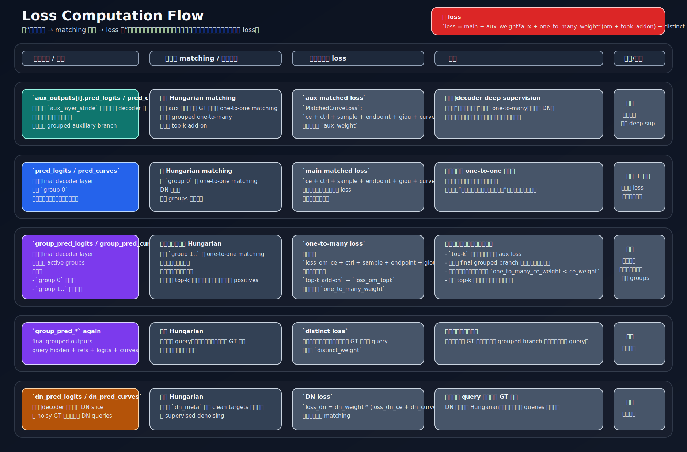

# Loss Flow Diagram

This page stores the current loss-flow figure for the parametric edge model.

Short reading guide:

- `aux matched loss` is decoder-layer deep supervision. It is unrelated to grouped one-to-many matching.
- `main matched loss` is computed only from the final layer and only from group 0.
- `one-to-many` is computed only from the final layer grouped outputs and only from auxiliary groups.
- `top-k positive` is no longer a separate auxiliary-layer loss. It is now an internal option inside the final-layer one-to-many branch.
- `distinct` also reads final grouped outputs.
- `DN` is sliced out before main matching and is supervised separately.

Practical summary:

- Decoder intermediate layers:
  - only contribute through `aux matched loss`
- Final decoder layer:
  - contributes to main one-to-one loss
  - contributes to grouped one-to-many loss
  - contributes to top-k grouped positives if enabled
  - contributes to distinct regularization
  - contributes to DN loss for the DN slice
