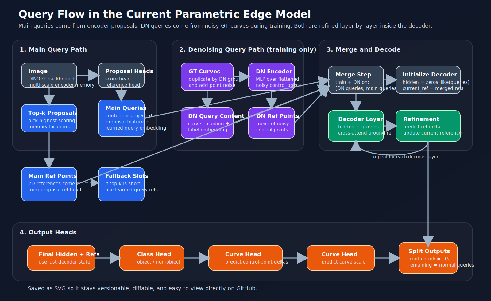

# Query Flow Diagram

This page stores the current query-flow figure for the parametric edge model.

Short reading guide:

- Main queries come from encoder proposals, not from purely random learned slots.
- DN queries are built only during training from noisy GT curves.
- Both paths merge before the decoder.
- Decoder layers refine the current reference points iteratively.
- Final outputs are split back into DN outputs and normal prediction outputs.